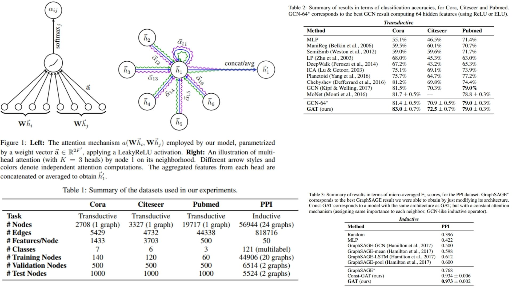

# 🪐 GAT-Replication — Graph Attention Networks

This repository provides a **forward-only PyTorch replication** of the  
**Graph Attention Network (GAT)** architecture for graph-structured data.

The emphasis is on **faithful reproduction of the paper’s mathematical formulation, attention mechanism, and architectural flow**, rather than training performance or benchmarking.  
It implements the GAT concept — **node-level attention with multi-head aggregation** — in a modular and clear manner.

Highlights include:

- Masked self-attention across node neighborhoods ✦  
- Multi-head attention for stable feature aggregation ⚛  
- Structure-agnostic node representation learning across graphs 🌐  

Paper reference: [Graph Attention Networks (Veličković et al., 2018)](https://arxiv.org/abs/1710.10903)

---

## Overview — Attention-Based Graph Representation 🧩



> Each node attends over its neighbors, learning to assign importance weights dynamically.

GAT integrates:

- **Stacked graph attention layers** producing node embeddings  
- **Multi-head attention** combining multiple independent feature representations  

This produces **flexible and expressive node embeddings** applicable to inductive and transductive tasks.

---

## Graph Representation Setup ⚙️

A graph is defined as:

$$
G = (V, E)
$$

with node features:

$$
H^{(0)} = X \in \mathbb{R}^{N \times F}
$$

---

## Graph Attention Layer ✨

Attention coefficients between nodes:

$$
e_{ij} = a(W h_i, W h_j)
$$

Normalized with softmax:

$$
\alpha_{ij} = \text{softmax}_j(e_{ij}) = \frac{\exp(e_{ij})}{\sum_{k \in \mathcal{N}_i} \exp(e_{ik})}
$$

Node feature update:

$$
h_i' = \sigma\left(\sum_{j \in \mathcal{N}_i} \alpha_{ij} W h_j\right)
$$

where $W$ is a learnable weight matrix and $\sigma$ is a nonlinearity (LeakyReLU in the paper).

---

## Multi-Head Attention 🌀

Aggregating $K$ independent attention mechanisms:

### Concatenation (intermediate layers)
$$
h_i' = \big\|_{k=1}^{K} \sigma\left(\sum_{j \in \mathcal{N}_i} \alpha_{ij}^k W^k h_j\right)
$$

### Averaging (final layer)
$$
h_i' = \sigma\left(\frac{1}{K} \sum_{k=1}^{K} \sum_{j \in \mathcal{N}_i} \alpha_{ij}^k W^k h_j \right)
$$

This stabilizes learning and allows capturing diverse interactions across neighbors.

---

## Why GAT Matters 🔮

- Assigns **adaptive importance** to neighboring nodes  
- Fully concurrent computation across all graph edges and nodes
- Directly applicable to **inductive learning** (unseen graphs)  
- Provides interpretable attention weights per edge  

This replication emphasizes **paper fidelity and theoretical clarity**.

---

## Repository Structure 🗂

```bash
GAT-Replication/
├── src/
│
│   ├── layers/
│   │   ├── graph_attention_layer.py   # Core GAT attention layer (paper math)
│   │   ├── multi_head.py              # Multi-head wrapper (concat / avg)
│   │   ├── attention_mechanism.py     # e_ij calculation (a^T [Wh_i || Wh_j])
│   │   └── activation.py              # LeakyReLU + other nonlinearities
│
│   ├── utils/
│   │   └── initialization.py          # Weight initialization for attention stability
│
│   ├── encoder/
│   │   ├── gat_encoder.py             # Stacked GAT layers
│   │   └── readout.py                 # Node → graph embedding aggregation
│
│   ├── model/
│   │   └── gat_model.py               # Full forward pipeline
│
│   └── config.py                      # Paper hyperparameters
│
├── images/
│   └── figmix.jpg                      # Overview figure
│
├── requirements.txt
└── README.md
```
---


## 🔗 Feedback

For questions or feedback, contact: [barkin.adiguzel@gmail.com](mailto:barkin.adiguzel@gmail.com)
